# Game Development - Tutorial 4

- **Name:** Feru Pratama Kartajaya
- **NPM:** 2106750351
- **Topic:** Basic 2D Level Design

---

## Latihan Mandiri: Membuat Level Baru Dengan Tile Map & Obstacle Berbeda

### New Obstacle: Saw

Level 2 memperkenalkan obstacle baru yang harus dihindari Player, yaitu Saw. Saw merupakan RigidBody2D dengan collision berbentuk lingkaran. Setelah di-spawn ke dalam level, Saw akan mulai jatuh hingga menyentuh lantai. Apabila Fish akan langsung despawn setelah menyentuh lantai, Saw akan tetap ada dan dapat bergerak dengan menggelinding pada slope. Player akan kalah game jika menyentuh Saw dan harus mengulang level dari awal.

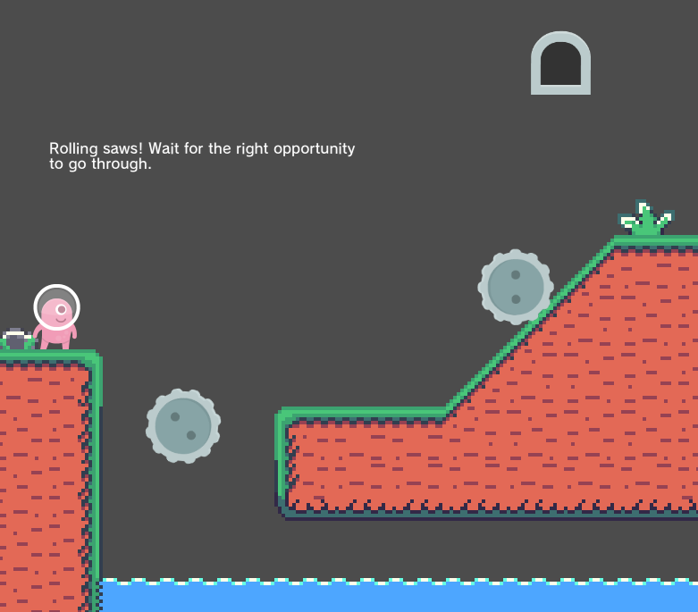

Berikut merupakan script yang bersangkutan dengan Saw. Seperti Fish, Saw memiliki sebuah HurtBox untuk mendeteksi collision dengan Player. Saat Player memasuki area HurtBox, signal akan memicu game untuk bertransisi ke scene kekalahan. Terdapat dua kondisi yang digunakan untuk despawn Saw. Pertama, Saw akan despawn apabila jatuh ke DeathPlane di bawah level. Kedua, Saw memiliki node Timer yang akan memicu despawn 10 detik setelah instansiasi. Kondisi kedua ada untuk memastikan Saw bisa despawn apabila berhenti di tengah level dan tidak bisa jatuh ke DeathPlane.

```py
# Saw.gd
extends RigidBody2D

@export var scene_name = "LoseScreen"


func _ready() -> void:
	$DeletionTimer.start()


func _on_HurtBox_body_entered(body: Node2D) -> void:
	if body.get_name() == "Player":
        # Player lose
		get_tree().change_scene_to_file(str("res://scenes/" + scene_name + ".tscn"))
	elif body.get_name() == "DeathPlane":
        # Despawn if fall off level
		self.queue_free()


func _on_DeletionTimer_timeout() -> void:
    # Despawn after timer ends
	self.queue_free()
```

### New Spawner: StaticSpawner

Sebelumnya, Fish di-spawn ke dalam level dengan RandomSpawner. Spawner tersebut akan melakukan spawn pada posisi x acak dalam suatu range. Sekarang, Saw di-spawn ke dalam level dengan StaticSpawner. Seperti namanya, spawner ini hanya akan melakukan spawn pada satu posisi yaitu pada titik origin dari node spawner.

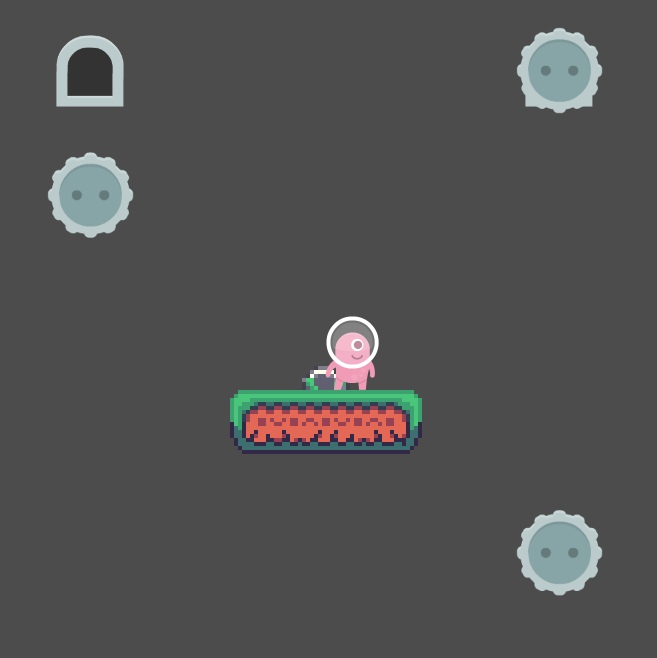

Berikut merupakan script dari StaticSpawner. Penggunaan fungsi _repeat() dan _spawn() akan menginstansiasi sebuah Saw pada titik origin node per jangka waktu. Jangka  waktu antara spawn dapat ditetapkan oleh developer dengan default 2.5 detik. Developer juga dapat mengatur offset waktu hingga spawner mulai bekerja. Opsi ini dapat digunakan untuk membuat beberapa spawner dengan cycle berbeda.

Setiap node yang menggunakan script StaticSpawner dapat menyediakan sprite SpawnerGuide untuk memberikan visual hint atas lokasi spawner. SpawnerGuide berguna untuk membuat level design lebih jelas kepada pemain. SpawnerGuide dapat di-hide melalui kotak centang di property node.

```py
# StaticSpawner.gd
extends Node2D

@export var obstacle: PackedScene
@export var view_guide = true
@export var spawn_interval = 2.5
@export var start_offset = 0.0

@onready var spawn_guide = $SpawnerGuide


func _ready():
    # Hide guide if unchecked
	if !view_guide:
		spawn_guide.visible = false

    # Start after offset
	if start_offset:
		await get_tree().create_timer(start_offset).timeout

	repeat()


func spawn():
	var spawned = obstacle.instantiate()
	get_parent().add_child(spawned)

	var spawn_pos = global_position
	spawned.global_position = spawn_pos


func repeat():
    # Spawn loop
	spawn()
	await get_tree().create_timer(spawn_interval).timeout
	repeat()
```

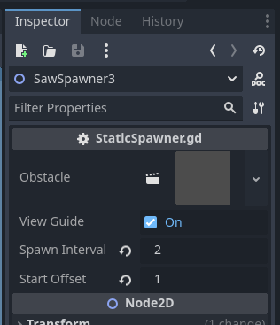

### New Scene and Tilemap: Level 2

Level 2 merupakan level baru yang memanfaatkan Saw dan StaticSpawner yang telah dijelaskan sebelumnya. Selain itu, Level 2 menggunakan tilemap baru dengan sprite sheet yang berbeda. Sprite sheet yang digunakan diciptakan oleh Thanshuny Wolf di itch.io (+ sedikit modifikasi oleh diri sendiri) dan dapat diunduh di [sini](https://thanshuny-wolf.itch.io/platformer-tileset).


Satu hal yang membedakan tilemap Level 2 dengan tilemap sebelumnya adalah kemunculan tile slope berukuran 2x1. Dengan penambahan ini berbeda, struktur level design dapat lebih bervariasi dari sebelumnya. Adanya dua ukuran slope juga bersifat sinergis dengan penggunaan Saw yang bergerak dengan menggelinding pada slope. Kecuraman slope yang berbeda akan membuat Saw menggelinding dengan kecepatan berbeda.

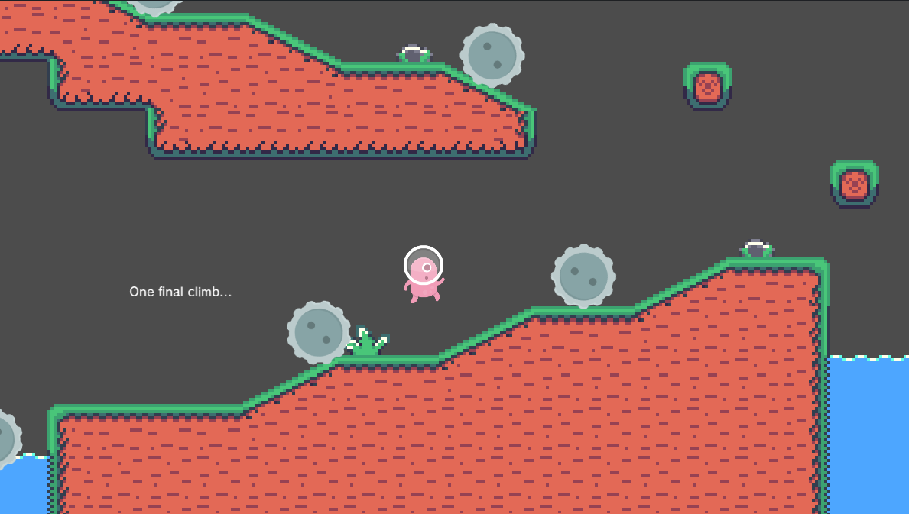

Tilemap juga memiliki beberapa tile dekoratif berupa tile air dan tumbuhan. Tile-tile tersebut digunakan untuk menghias level 2, dengan tile air digunakan untuk mengisi ruang kosong dari sebuah jurang.

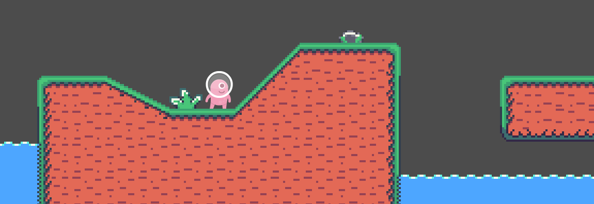

## Polishing Lanjutan

### Updated Level 1 Tilemap

Tilemap yang digunakan pada Level 1 telah dimodifikasi dengan beberapa tile tambahan dan satu tile dekoratif (batu). Berikut merupakan tile baru yang telah dibuat untuk tilemap.

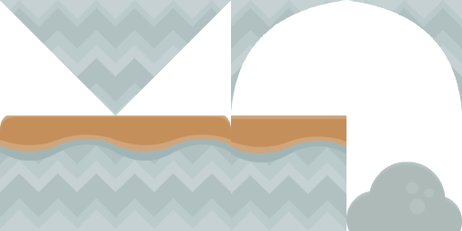

Penambahan tilemap bermakna untuk merapikan visual level agar tidak terlalu kaku. Tile *arch* lengkung dan diagonal digunakan untuk mempercantik struktur dari level design di bagian bawah platform. Terdapat juga tile lantai biasa dengan sudut yang rounded untuk digunakan di ujung platform.

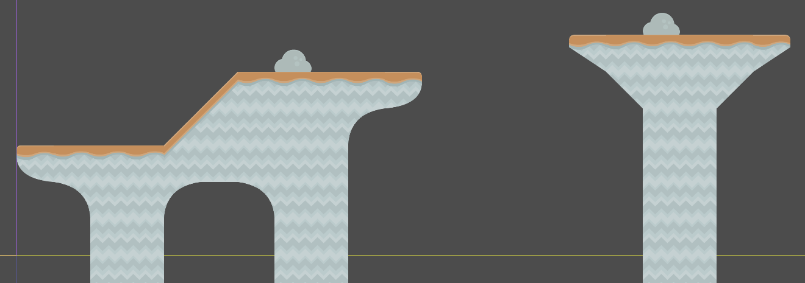

### Better Platformer Camera

Berikut merupakan tab Inspector untuk kamera Player. Pengaturan yang telah dibuat adalah sebagai berikut:

- Menambahkan limit kamera pada sisi kiri dan bawah untuk membatasi gerakan kamera. Sisi kiri dibatasi untuk menjaga posisi kamera di awal level, dan sisi bawah dibatasi agar kamera tidak mengikuti Player apabila jatuh ke dalam jurang. Opsi "Smoothed" digunakan untuk memuluskan gerakan kamera saat mendekati limit.
- Menerapkan drag kamera secara horizontal dan vertikal. Pengaturan ini menciptakan area kecil di tengah layar di mana Player dapat bergerak tanpa menggerakkan kamera. Adanya area ini akan mengurangi jumlah pergerakan kamera yang tiba-tiba.
- Menggunakan Position Smoothing untuk menghaluskan gerakan kamera saat Player bergerak.
- Mengubah proses callback kamera menjadi "Physics" untuk mengatasi masalah Godot me-render karakter dengan buram saat kamera bergerak dengan Position Smoothing ([#86634](https://github.com/godotengine/godot/issues/86634))

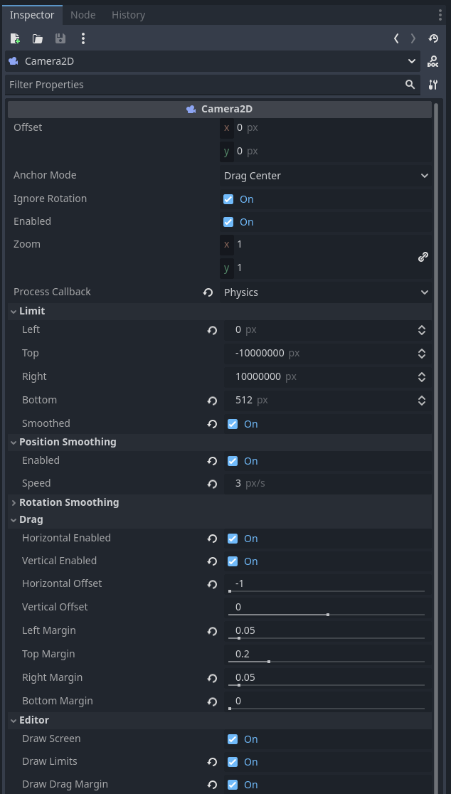

Selain itu, terdapat masalah lain dengan penggunaan Position Smoothing yaitu kamera akan mudah ketinggalan di belakang Player saat bergerak dengan cepat. Situasi ini mengakibatkan pemain tidak dapat melihat cukup banyak level di depannya. Untuk mengatasi masalah tersebut, kamera akan diberikan script PlayerCamera yang berfungsi untuk menerapkan offset terhadap posisi kamera berdasarkan pergerakan pemain. Script menggunakan Tween untuk menggerakkan kamera dengan mulus dan menjaga agar area di depan Player tetap dapat terlihat.

```py
extends Camera2D

const LOOK_AHEAD_FACTOR = 0.1
const SHIFT_TRANS = Tween.TRANS_SINE
const SHIFT_EASE = Tween.EASE_OUT
const SHIFT_DURATION = 1.2

var facing = 0
@onready var prev_camera_pos = get_screen_center_position()
@onready var tween: Tween


func _ready() -> void:
    # Immediately set camera into position
	reset_smoothing()


func _process(_delta: float) -> void:
	_check_facing()
	prev_camera_pos = get_screen_center_position()


func _check_facing():
    # Get facing direction
	var new_facing = sign(get_screen_center_position().x - prev_camera_pos.x)
	if new_facing != 0 && facing != new_facing:
        # Get camera offset
		facing = new_facing
		var target_offset = get_viewport_rect().size.x * LOOK_AHEAD_FACTOR * facing

        # Set position tween
		tween = create_tween()
		(
			tween
			. tween_property(self, "position:x", target_offset, SHIFT_DURATION)
			. set_trans(SHIFT_TRANS)
			. set_ease(SHIFT_EASE)
		)
```

Berikut merupakan gambaran kamera tanpa offset dan dengan offset untuk posisi dan gerakan Player yang sama. Tanpa offset, karakter berposisi lebih condong ke kanan dan kamera tidak menunjukkan banyak area di depan Player. Dengan offset, posisi karakter lebih seimbang di layar dan kamera menunjukkan lebih banyak area di depan Player dibandingkan sebelumnya.

**Before**
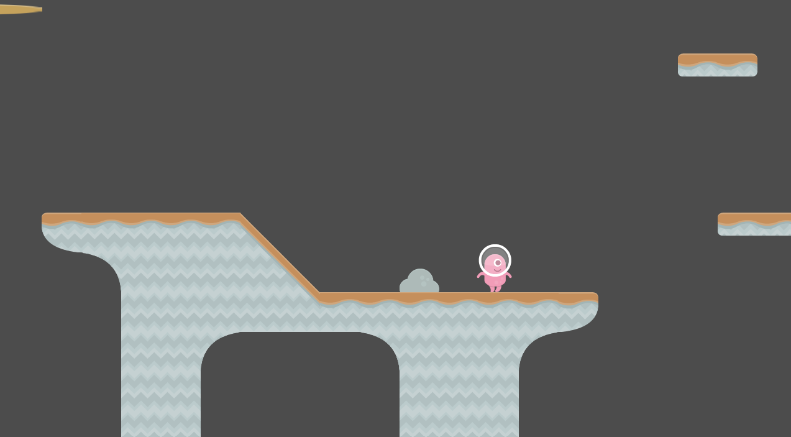

**After**
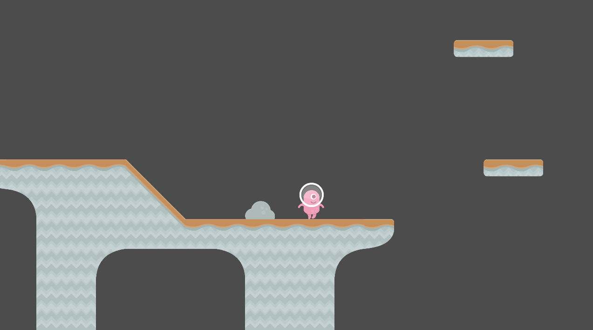


### Better RandomSpawner

Spawner untuk Fish telah di-refactor menjadi scene terpisah bernama FishSpawner. Untuk logika spawn, spawner menggunakan script RandomSpawner.

Berikut merupakan script dari RandomSpawner. Penggunaan fungsi `repeat()` dan `spawn()` akan menginstansiasi sebuah Fish dalam range horizontal `(-x,x)` relatif pada lokasi spawner. RandomSpawner akan melakukan satu spawn setiap detik. Sekarang, range horizontal dari area spawn dapat ditetapkan oleh developer dengan default 1000px (dan range total 2 * 1000 = 2000px).

Setiap node yang menggunakan script RandomSpawner dapat menyediakan sprite SpawnerGuide untuk memberikan visual hint atas lokasi spawner. SpawnerGuide berguna untuk membuat area yang terkena RandomSpawner lebih jelas kepada pemain, serta untuk playtesting dan mengatur posisi spawner. SpawnerGuide dapat di-hide melalui kotak centang di property node. Apabila area kamera sedang di bawah Spawner, SpawnerGuide akan di-update saat process frame agar posisinya berada di ujung atas layar. Proses ini memastikan agar SpawnerGuide dapat selalu terlihat dalam berbagai ketinggian. Tinggi SpawnerGuide tidak akan pernah melebihi tinggi node spawner sesungguhnya.

```py
# RandomSpawner.gd
extends Node2D

@export var obstacle: PackedScene
@export var spawn_range = 1000
@export var view_guide = true

@onready var spawn_guide = $SpawnerGuide


func _ready():
	if view_guide:
        # Set initial guide scale and position
		spawn_guide.scale.x = (2 * spawn_range) / spawn_guide.texture.get_width()
		spawn_guide.global_position.y = -get_viewport_transform().origin[1] + 16
	else:
		spawn_guide.visible = false
	repeat()


func _process(_delta: float) -> void:
	if view_guide:
        # Update guide vertical position according to viewport
		var next_position = -get_viewport_transform().origin[1] + 16
		if next_position > self.get_global_transform().origin[1]:
			spawn_guide.global_position.y = next_position
		else:
			spawn_guide.global_position.y = self.get_global_transform().origin[1]


func spawn():
	var spawned = obstacle.instantiate()
	get_parent().add_child(spawned)

	var spawn_pos = global_position
	spawn_pos.x = spawn_pos.x + randf_range(-spawn_range, spawn_range)

	spawned.global_position = spawn_pos


func repeat():
    # Spawn loop
	spawn()
	await get_tree().create_timer(1).timeout
	repeat()
```

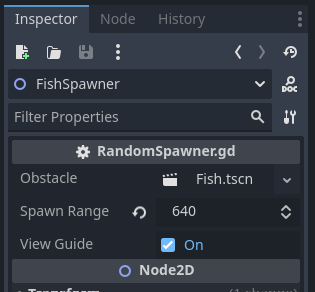

Berikut merupakan gambaran dari SpawnerGuide pada sebuah RandomSpawner. Garis kuning yang berada di atas layar membentang range dari RandomSpawner yang ditetapkan. Garis menggambarkan area di mana Fish dapat jatuh. SpawnerGuide akan menempel di bagian atas layar dan akan terus bergerak secara vertikal agar dapat selalu terlihat.

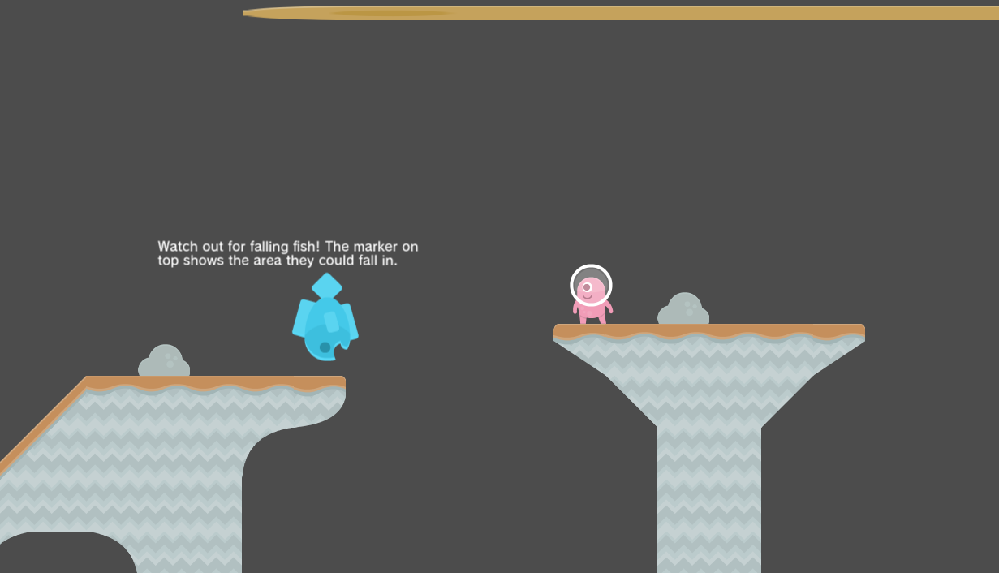

### Respawn After Lose Screen

Sebelumnya, scene akan bertransisi ke LoseScreen apabila Player terkena sebuah obstacle. Setelah berada di LoseScreen, pemain tidak dapat melakukan apapun dan harus menutup window game untuk bermain lagi. Sekarang, game akan respawn ke level yang sedang dimainkan setelah 3 detik di LoseScreen. Hal ini diterapkan melalui script LoseScreen dengan Timer, serta penetapan variabel global yang menyimpan level saat ini dengan script Global.gd.

```py
# Global.gd
extends Node

var current_level = "Level1"
```

```py
# SceneChanger.gd
extends Area2D

@export var scene_name: String = "Level1"


func _on_SceneChanger_body_entered(body):
	if body.get_name() == "Player":
        # Set current level when goal is reached
		if self.get_name() == "RocketGoal" and scene_name.begins_with("Level"):
			Global.current_level = scene_name
		get_tree().change_scene_to_file(str("res://scenes/" + scene_name + ".tscn"))
```

```py
# LoseScreen.gd
extends Node2D


func _ready() -> void:
    # Respawn sequence
	await get_tree().create_timer(3).timeout
	get_tree().change_scene_to_file(str("res://scenes/" + Global.current_level + ".tscn"))
```

## Referensi dan Resources

- Tutorial's GitHub page: https://csui-game-development.github.io/tutorials/tutorial-4/
- Official Godot GDScript reference: https://docs.godotengine.org/en/stable/tutorials/scripting/gdscript/gdscript_basics.html
- Official Godot Engine forums: https://forum.godotengine.org/
- Platformer Tileset by Thanshuny Wolf: https://thanshuny-wolf.itch.io/platformer-tileset
- Camera Smoothing causes jittering in Player again - Godot Engine Issues page: https://github.com/godotengine/godot/issues/86634
- Godot 3.2 Let's Build a 2D Platformer!: Part 6 (Camera-Follow & Game Resolution) by BornCG: https://youtu.be/z--IEsXl5zc
- How to Improve Your Camera for Platformers in Godot 3.1 by Game Endeavor: https://youtu.be/sxtC7hj2ABY
- Godot 4 Global Variables by Gwizz: https://youtu.be/sc-tEPdLZhk

---

# Game Development - Tutorial 6

- **Name:** Feru Pratama Kartajaya
- **NPM:** 2106750351
- **Topic:** Menu and In-Game Graphical User Interface

---

## Latihan Mandiri: Fitur Tambahan

### A. System
Terdapat beberapa perubahan sistem yang telah diterapkan selama tutorial ini.
#### Lives and Death
Sebelumnya, pemain dapat mati berulang kali dalam sebuah level dan masih dapat melanjutlan game. Sekarang, pemain diberikan 3 lives yang akan berkurang apabila pemain mati. Pemain dapat kehilangan life dengan jatuh ke jurang atau menyentuh rintangan Fish dan Saw. Setelah mati, game akan menunggu sejenak sebelum melakukan reload scene.

```py
# Global.gd
extends Node

var lives = 3
```

```py
# DeathArea.gd
extends Area2D


func _on_body_entered(body):
	if body.get_name() == "Player":
		# Kill
		Global.lives -= 1
		body.kill()
		await get_tree().create_timer(1.5).timeout

		# Load appropriate scene
		if Global.lives > 0:
			get_tree().call_deferred("reload_current_scene")
		else:
			get_tree().call_deferred("change_scene_to_file", "res://scenes/GameOver.tscn")
```
```py
# Player.gd
@export var in_control: bool = true

func enable_controls():
	in_control = true


func disable_controls():
	in_control = false
	velocity = Vector2(0, 0)


func kill():
	# Disable physics and controls
	$CollisionShape2D.set_deferred("disabled", true)
	self.set_physics_process(false)
	disable_controls()

	$Sprite2D.set_visible(false)


func _physics_process(delta):
	velocity.y += delta * gravity
	if in_control:
		get_input()
	move_and_slide()
```

Apabila pemain kehabisan lives, game akan berakhir dan pemain harus mengulangi game dari awal. Lives disimpan sebagai variabel global dengan DeathArea yang akan menangani logika kematian. Untuk menyesuaikan sistem baru dengan implementasi sebelumnya, Fish dan Saw mendapat sedikit modifikasi.

```py
# Fish.gd
extends RigidBody2D


func _on_body_entered(body: Node2D) -> void:
	if body.get_name() == "Player":
		self.set_deferred("freeze", true)
		self.hide()
	else:
		self.queue_free()
```

```py
# Saw.gd
extends RigidBody2D


func _ready() -> void:
	$DeletionTimer.start()


func _on_body_entered(body: Node2D) -> void:
	if body.get_name() == "Player":
		self.set_deferred("freeze", true)
		$CollisionShape2D.set_deferred("disabled", true)
		$DeletionTimer.stop()
		self.hide()
	elif body.get_name() == "DeathPlane":
		self.queue_free()


func _on_DeletionTimer_timeout() -> void:
	self.queue_free()
```

#### BGM and SFX
Controller global untuk memainkan BGM telah diterapkan sesuai dengan implementasi yang telah saya lakukan di Tutorial 5. Sejumlah SFX juga telah ditambahkan untuk aksi berikut: Player meloncat, Player mati, dan roket Goal meluncur. Terlebih lagi, audio bus terpisah telah dialokasikan untuk BGM dan SFX.

```py
#BGMController.gd
extends Node

@onready var bgm = {
	"Menu": load("res://assets/bgm/menu.ogg"),
	"Game": load("res://assets/bgm/gameplay.ogg"),
	"Win": load("res://assets/bgm/win.ogg"),
	"Lose": load("res://assets/bgm/gameover.ogg"),
}


func _ready() -> void:
	$BGM.stream = bgm.Menu
	$BGM.play()


func play() -> void:
	$BGM.play()


func stop() -> void:
	$BGM.stop()


func change_music(music) -> void:
	$BGM.stream = bgm[music]
	$BGM.play()
```

```py
# Player.gd
@onready var sfx = {
	"Jump": $SFX/Jump,
	"Die": $SFX/Die,
}


func get_input():
	velocity.x = 0
	if is_on_floor() and Input.is_action_just_pressed("jump"):
		velocity.y = jump_speed
		sfx.Jump.play()
	...

func kill():
	$CollisionShape2D.set_deferred("disabled", true)
	self.set_physics_process(false)
	disable_controls()

	$Sprite2D.set_visible(false)
	sfx.Die.play()
```

### B. Level UI
Saat berada di dalam level, terdapat beberapa elemen UI yang dapat dilihat dan ditampilkan kepada pemain.

#### Lives Counter
Counter yang menghitung jumlah lives dari pemain dapat ditemukan pada sudut kiri atas layar. Tampilan dari counter akan segera update setelah pemain mati.
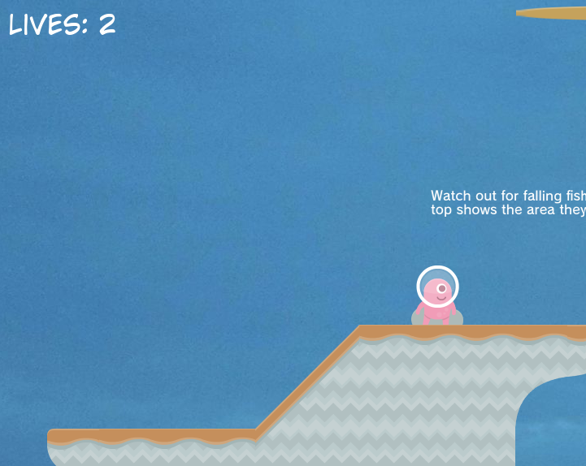


#### Pausing and Pause Menu
Pemain dapat menghentikan level sejenak dengan menekan tombol Pause di sudut kanan atas layar. Saat ditekan, proses permainan di dalam level akan berhenti dan Pause Menu akan ditampilkan. Di dalam Pause Menu, pemain dapat memilih Resume untuk melanjutkan permainan atau Quit Game untuk kembali ke Main Menu.

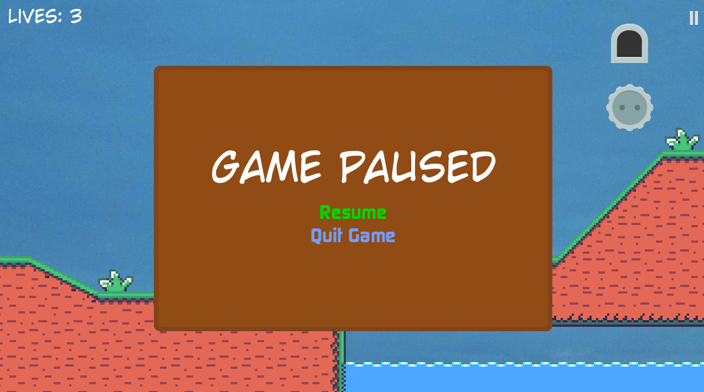

#### Level Clear Menu
Sebelumnya, berpindah antara level terjadi secara langsung setelah menyentuh Goal berbentuk roket. Sekarang, game akan menunggu sejenak sebelum menampilkan Level Clear Menu untuk menandakan pemain telah melewati level. Di dalam Level Clear Menu, pemain dapat memilih Continue untuk lanjut ke level berikutnya atau Quit Game untuk kembali ke Main Menu.

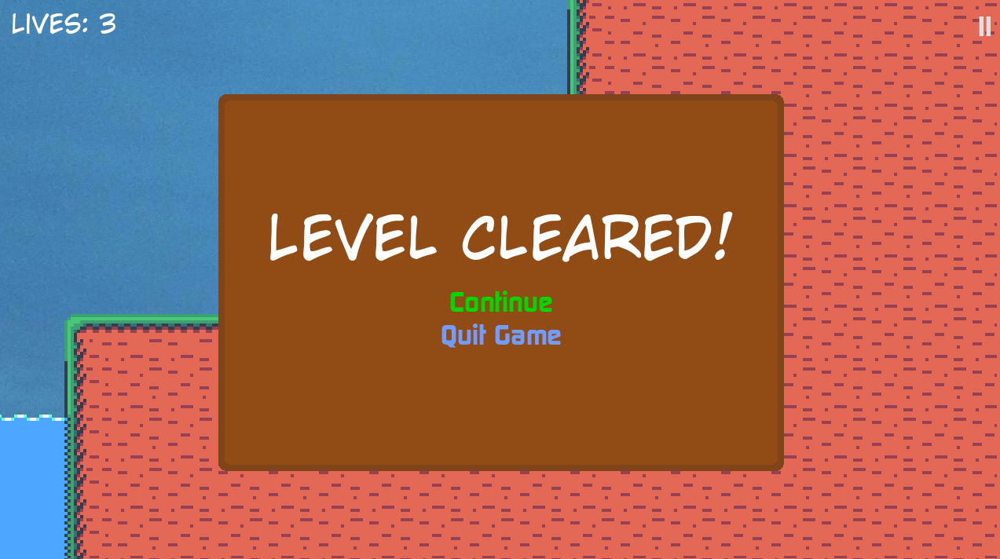

Level Clear Menu disimpan di dalam satu scene dengan Goal. Goal sendiri telah ditambahkan properti baru bernama "Last". Apabila diaktifkan, Goal berperan sebagai akhir dari game. Saat aktif, Level Clear Menu hanya akan menampilkan opsi Continue. Memilih Continue akan melanjutkan pemain ke Win Screen.

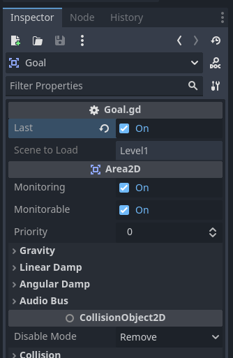
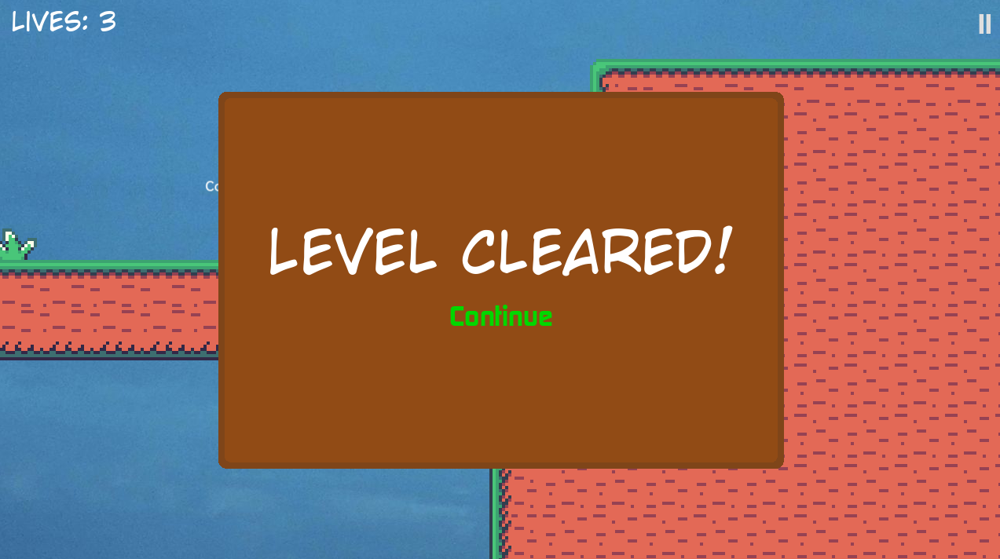

Saat properti "Last" aktif, properti sebelumnya yang menentukan scene yang akan diload berikutnya tidak digunakan. Untuk berjaga-jaga, properti tersebut akan dibuat Read-Only apabila "Last" diaktifkan.

```py
# Goal.gd
@export var last: bool:
	set(value):
		last = value
		notify_property_list_changed()
@export var scene_to_load: String = "Level1"

func _validate_property(property: Dictionary):
	if property.name == "scene_to_load" and last:
		property.usage |= PROPERTY_USAGE_READ_ONLY
```

### C. Main Menu
Game dimulai dari sebuah Main Menu yang memiliki sejumlah opsi.

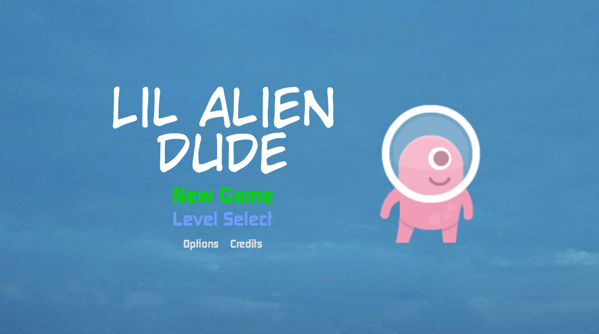

#### Start Game
Opsi ini akan memulai game dari level pertama dan akan berlangsung hingga pemain menang, kalah, atau sengaja keluar dari game. Setiap kali game dimulai, lives pemain diset kembali menjadi 3.

#### Level Select
Opsi ini akan memindahkan pemain ke menu Level Select. Di menu tersebut, pemain dapat memilih level mana ia akan memulai game. Untuk tutorial ini, terdapat 4 level yang dapat dipilih. Jumlah lives pemain juga akan reset seperti pada opsi Start Game.

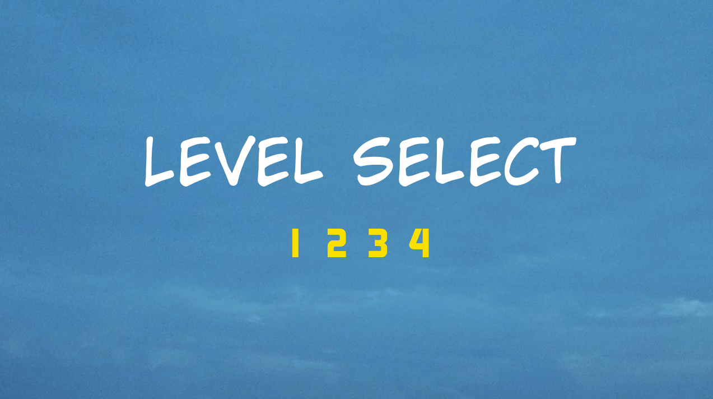

#### Options
Opsi ini akan menampilkan Options Menu dalam bentuk pop-up. Di menu tersebut, terdapat sejumlah slider yang dapat digunakan untuk mengatur volume dari audio game. Terdapat 3 slider untuk ketiga audio bus yang ada: Master Volume (semua suara), Music Volume, dan SFX Volume. Dengan ini, pemain dapat mengatur audio secara lebih presisi. Terdapat tombol X di sudut kiri atas menu yang akan menutup menu saat ditekan.

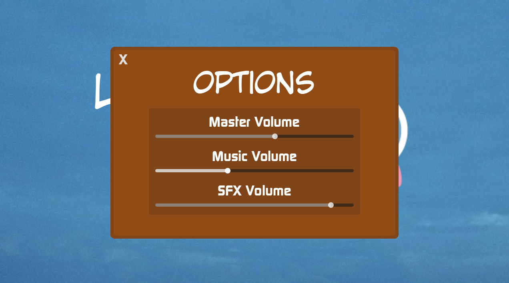

#### Credits
Opsi ini akan menampilkan Credits Menu dalam bentuk pop-up. Di menu tersebut, terdapat informasi mengenai asset-asset bawaan yang digunakan dalam game ini. Informasi terbagi menjadi 3 bagian: Music, SFX, dan Art. Isi dari Credits Menu dibaca langsung dari file teks assets/credits.txt dan disimpan ke dalam label saat node menu diciptakan.

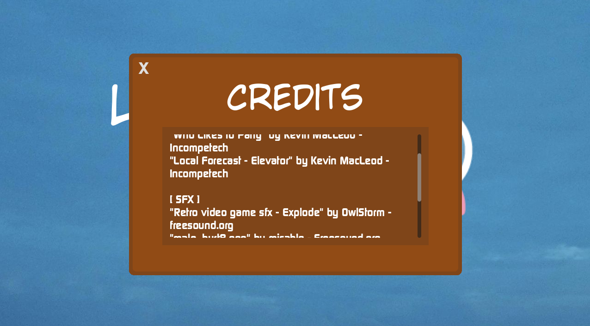

### D. Additional Polishing

Berikut merupakan beberapa hal lain yang saya lakukan saat mengerjakan tutorial.

#### Level Clear Animation
Setelah mencapai Goal, terdapat animasi baru yang menampilkan roket meluncur ke angkasa. Animasi ini dihasilkan dengan AnimationPlayer, SFX untuk suara roket, dan sprite baru untuk api roket.

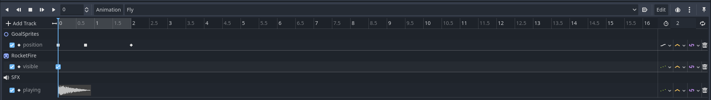

#### Win and Game Over Screens
Win Screen dan Game Over Screen telah ditingkatkan dengan menggunakan node-node Control dan BGM khusus. Sekarang, terdapat opsi Back to Main Menu agar pemain dapat kembali mengulang game setelah mencapai salah satu screen tersebut.

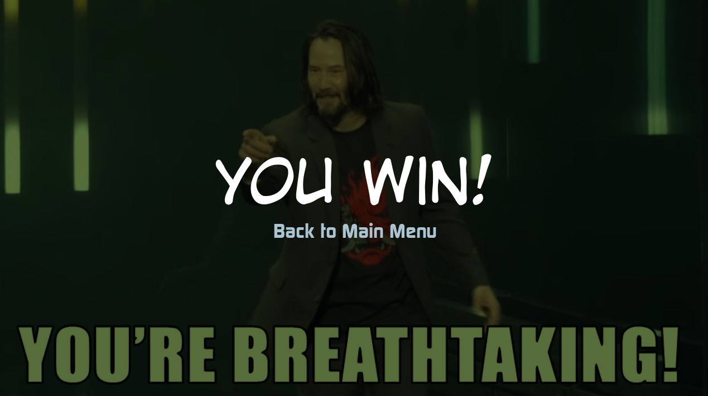
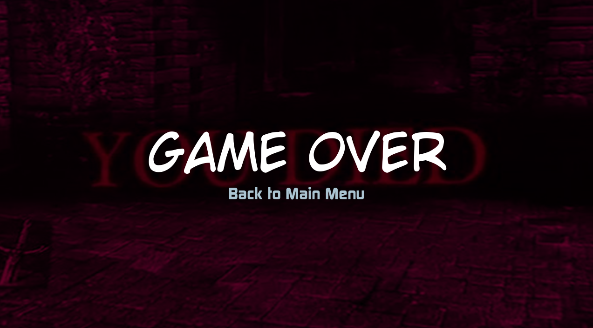

#### Global Fade Transitions
Terdapat animasi Fade In dan Fade Out yang terjadi saat berganti scene. Transisi tersebut digunakan untuk memperhubungkan antar scene dengan lebih mulus dan memberikan waktu untuk mempersiapkan scene sepenuhnya (cth. memposisikan kamera kepada Player dengan benar saat memulai level). Transisi memanfaatkan node CanvasLayer yang telah diletakkan pada layer tinggi dan sebuah ColorRect.


#### Global Background
Pada global scene yang sama dengan transisi fade, sebuah background langit telah ditambahkan untuk melengkapi penampilan dari game.

## Assets

```
[ Music ]
"Call to Adventure" by Kevin MacLeod - Incompetech
"Heartbreaking" by Kevin MacLeod - Incompetech
"Who Likes to Party" by Kevin MacLeod - Incompetech
"Local Forecast - Elevator" by Kevin MacLeod - Incompetech

[ SFX ]
"Retro video game sfx - Explode" by OwlStorm - freesound.org
"male_hurt8.ogg" by micahlg - Freesound.org
"jump boing" by 1bob - Freesound.org

[ Art ]
"Platformer Pack Redux" by Kenney Assets - Kenney.nl
"Platformer Tileset" by Thanshuny Wolf - itch.io
```

## Referensi dan Resources

- Tutorial's GitHub page: https://csui-game-development.github.io/tutorials/tutorial-4/
- Official Godot GDScript reference: https://docs.godotengine.org/en/stable/tutorials/scripting/gdscript/gdscript_basics.html
- Official Godot Engine forums: https://forum.godotengine.org/
- Creating volume sliders in Godot 4 by The Shaggy Dev: https://youtu.be/aFkRmtGiZCw
- Ability to dynamically hide exported variables in the inspector - godot-proposals GitHub issue: https://github.com/godotengine/godot-proposals/issues/1056
---